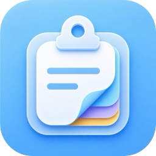

<div align="center">
  

  <h1>Clipaste</h1>

  <p>
    <strong>A fast clipboard manager for Mac, now with an iOS clipboard keyboard.</strong>
  </p>

  <p>
    Keep your clipboard history on your Mac, and bring it to iOS when you type.
  </p>

  <p>
    <a href="README.zh.md">简体中文</a>
    ·
    <a href="README.md">English</a>
  </p>

  <p>
    <a href="https://github.com/gangz1o/Clipaste/releases/latest">
      
    </a>
    
    
    
  </p>

  <p>
    <a href="#macos-install">Download for macOS</a>
    ·
    <a href="https://apps.apple.com/cn/app/clipaste-%E5%89%AA%E8%B4%B4%E6%9D%BF%E9%94%AE%E7%9B%98/id6768657055" target="_blank">Get iOS Keyboard</a>
    ·
    <a href="https://github.com/gangz1o/Clipaste/releases/latest" target="_blank">Latest Release</a>
  </p>
</div>

---

## iOS Clipboard Keyboard

Clipaste for iOS is a keyboard, not just a clipboard viewer. Switch to it from the system keyboard picker, choose a saved clip, and paste without leaving the app you are typing in.

When iCloud sync is enabled, clips saved on your Mac can appear in the iOS keyboard. Text, links, and images can move with you without sending them to yourself or keeping another app open. Sync uses Apple's iCloud / CloudKit, so it runs through the Apple account and system services you already trust.

<p align="center">
  <a href="https://apps.apple.com/cn/app/clipaste-%E5%89%AA%E8%B4%B4%E6%9D%BF%E9%94%AE%E7%9B%98/id6768657055">
    
  </a>
</p>

The App Store badge currently points to the China storefront; Apple may redirect it depending on your region. If it does not open correctly, search for `Clipaste` or `Clipaste Clipboard Keyboard` in your local App Store.

<div align="center">
  
  
  
  
</div>

## Preview

<div align="center">
  
  
</div>
<br />
<div align="center">
  
  
</div>

## What Clipaste Does

### iOS Keyboard

- Switch to Clipaste from the iOS keyboard picker whenever you need a saved clip.
- Reuse Mac clipboard history while typing on iOS.
- Paste text, links, and images without opening a separate clipboard app.

### Mac Clipboard Manager

- Fast daily interactions, even with a large clipboard history.
- Smooth horizontal and vertical layouts.
- Responsive handling of large text entries.
- Image text recognition with searchable image content.
- Quick preview, search, copy, and paste workflows.

### Sync & Migration

- Optional iCloud / CloudKit sync between Mac and iOS.
- Migration from **Paste**, **PasteNow**, **Maccy**, and **iCopy**.
- Native SwiftUI and SwiftData architecture.
- Free and open source.

## Why Clipaste

Many clipboard managers start to feel heavy once the history grows, especially when the saved content includes large text payloads or lots of images.

Clipaste is built around that problem. It focuses on staying quick under real use: browsing, searching, previewing, and pasting should still feel immediate when your clipboard history is no longer small.

If you have used Paste or PasteNow before, the difference is straightforward: Clipaste puts more emphasis on large-history performance, keeps heavier text content responsive, and gives you layout flexibility plus open-source extensibility.

## Migration

Clipaste can migrate clipboard history from:

- Paste
- PasteNow
- iCopy
- Maccy

The goal is simple: switch without losing your existing history.

## Tech Stack

- **SwiftUI** for the interface
- **SwiftData** for storage and migration
- **CloudKit** for optional sync
- Native macOS app architecture

## Requirements

- macOS 14.0+
- Xcode 16+

## Install

<a id="macos-install"></a>

### macOS

Recommended installation method:

```bash
brew tap gangz1o/clipaste
brew install --cask gangz1o-clipaste
```

To update Clipaste, you can either:

- Use the in-app updater
- Update via Homebrew:

```bash
brew update
brew upgrade --cask gangz1o-clipaste
```

### iOS

<a href="https://apps.apple.com/cn/app/clipaste-%E5%89%AA%E8%B4%B4%E6%9D%BF%E9%94%AE%E7%9B%98/id6768657055">
  
</a>

You can also search for `Clipaste` / `Clipaste Clipboard Keyboard` in your App Store region.

## Build

1. Open `clipaste.xcodeproj` in Xcode.
2. Select your own signing team if you want to run the app with iCloud / push entitlements.
3. Build and run.

If you fork this project and want to distribute your own build, you will also need your own:

- Bundle identifier
- iCloud container
- Apple signing configuration

## Releases

Maintainers can generate and upload a notarized DMG using the GitHub Actions workflow documented in [RELEASING.md](RELEASING.md).

## Star History

<a href="https://www.star-history.com/?repos=gangz1o%2FClipaste&type=date&legend=top-left">
 <picture>
   <source media="(prefers-color-scheme: dark)" srcset="https://api.star-history.com/chart?repos=gangz1o/Clipaste&type=date&theme=dark&legend=top-left" />
   <source media="(prefers-color-scheme: light)" srcset="https://api.star-history.com/chart?repos=gangz1o/Clipaste&type=date&legend=top-left" />
   
 </picture>
</a>

## Community

Have questions, ideas, or just want to chat with a community of developers?

- **Forum**: [linux.do](https://linux.do/) — Join the discussion, share your setup, report issues, and stick around.
